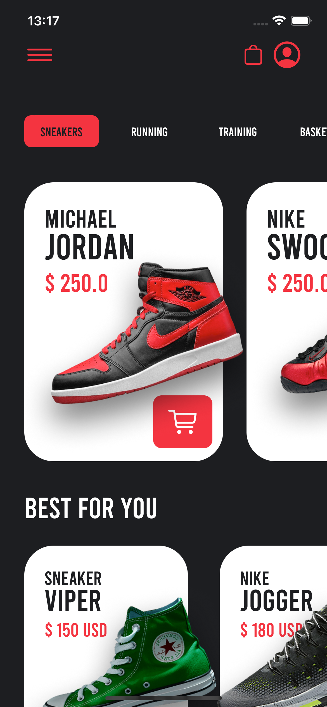
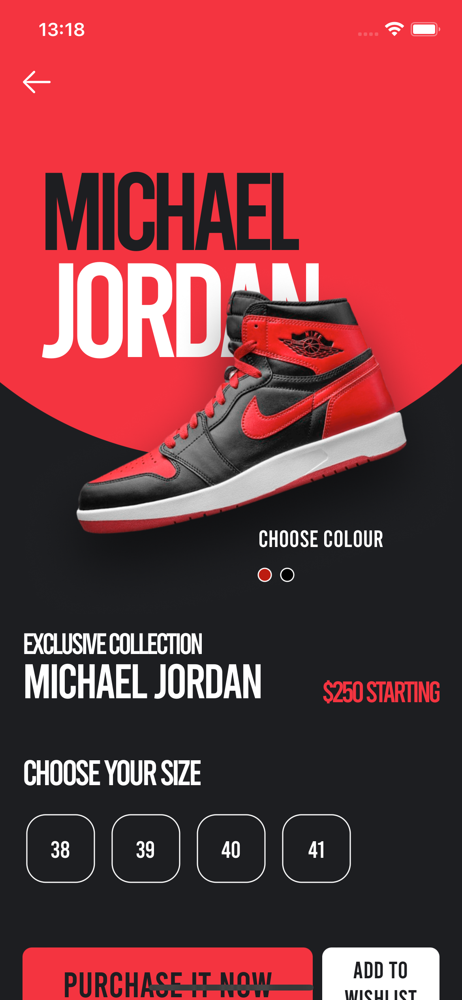

<h1 align="center">
 
  
 
 
Sneakers App
</h1>

Aplicativo desenvolvido com intuito de praticar SwiftUI e MVVM, lista sneakers e permite ver detalhes dos mesmos

# 📋 Índice

- [Telas](#-Telas)
- [Sobre o projeto](#-Sobre-o-projeto)
- [Tecnologias utilizadas](#-Tecnologias-utilizadas)
- [Rodando o projeto](#-Rodando-o-projeto)
  - [Pré-requisitos](#-Pré-requisitos)
  - [Rodando o aplicativo mobile](#-Rodando-o-aplicativo-mobile)

## 🎨 Telas

## 📃 Sobre o projeto

Aplicativo desenvolvido com intuito de praticar SwiftUI e MVVM, lista sneakers e permite ver detalhes dos mesmos.

Feito inteiramente com SwiftUI, os dados dos sneakers estão mockados dentro da ViewModel da Home mas o app pode facilmente ser adaptado para consumir uma API

## 🛠 Tecnologias utilizadas

- 🍎 **SwiftUI** — App UI

## 🚀 Rodando o projeto

### Pré-requisitos

- Macbook
- Xcode 14

### 📱 Rodando o app

<ol>
  <li>Clone o projeto</li>
  <li>Abra o arquivo sneakersApp.xcodepro no xcode</li>
  <li>Rode o app ou utilize os Previews</li>
</ol>
